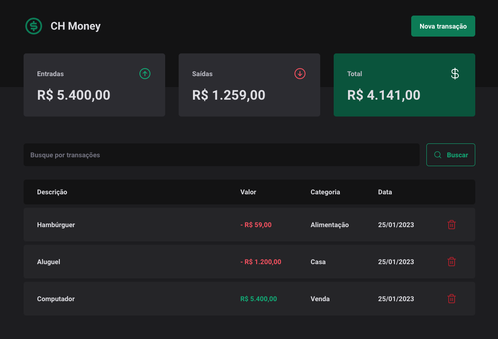

<h1 align='center'>💰 CH Money - Personal Finances app</h1>



<br>

# Technologies used

- TypeScript
- Vite
- axios
- react-hook-form
- zod
- radix-ui
- use-context-selector
- styled-components

# Instructions

To run front-end:

```bash
yarn dev
```

To run `json-server`:

```bash
yarn dev:server
```
